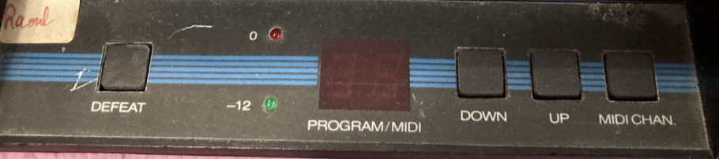

# Midiverb/Midiverb II emulator




<h3>There's a <a href="https://github.com/thement/midiverb_emulator/releases">VST3 plugin</a> now. Also a <a href="http://ibawizard.net/midiverb">WEB DEMO</a>!</h3>

## What is this

This is an emulator for the original **Midiverb**, **Midifex** and **Midiverb II** effect units made by Alesis.

The core is DASP-family DSP processor µ-code emulator.

There's a decompiler that outputs C code which makes it possible to run at *full-speed* which is exactly what is done for the *VST-3 plugin*.

## Contents of the repository

* [command-line emulator](midiverb.c)
* [disassembler/decompiler](disasm.py) of DSP µ-code
* [VST3 plugin](MidiverbPlugin) which is available for download in [releases](https://github.com/thement/midiverb_emulator/releases)
* [web demo](web-demo) which is <a href="http://ibawizard.net/midiverb">live here</a>

## Support


|  | CLI emulator | web demo | VST3 plugin |
|---|---|---|---|
| Midiverb+Midifex emulation |  100% | 100% | - |
| Midiverb 2 emulation | 90%<sup>*</sup> | 90%<sup>*</sup> | - |
| Midiverb+Midifex native | 100% | - | 100% |
| Midiverb 2 native | 60%<sup>**</sup> | - | 60%<sup>**</sup> |

What is missing:

<sup>*</sup> Triggers for flanger are not implemented<br>
<sup>**</sup> LFO is not supported in the native version<br>
Chorus/Flanger  effects (50-69) are NOT WORKING in VST3 because of the previous point<br>
Pre-emphasis/antialiasing filter modelling, output filter modelling<br>


## `midiverb` CLI tool

This is a simple command-line tool for adding effects to wav files.

It supports two modes:
* emulation, which requires original ROMs to run (`midiverb.rom`, `midifex.rom` or `midiverb2.rom`)
* using internal decompiled Midiverb effects - that doesn't require the ROMs but not all features are supported

How to build it:
- requires libsndfile to build: `apt-get install libsndfile-dev`
- then just `make`

### Example usage

Inputs and outputs are stereo WAV files, 23.4 KHz, 16-bit, signed integer. The effect doesn't resample the input so if you run wavs at 48 KHz you will run the effect twice as fast.

```
$ sox i_feel_so_liberated.wav -t wav -e signed-integer -b 16 -r 23400 input.wav
```

By default internal implementation of effects from `Midiverb II` is used.
The effect programs are numbered the same way as on the original unit.
The following example runs 100% wet effect no. 15 from Midiverb II.

```
$ ./midiverb 15 input.wav output.wav
using internal decompiled effects for MidiVerb 2
effect name: Medium Bright 1.1 Sec
channels=2, sample_rate=23400, num=93600
```

`midiverb` supports wet/dry mixing and feedback. This runs 40% wet effect no 15 from midiverb with 50% feedback.

```
$ ./midiverb -m midifex 15 -d 0.4 -f 0.5 input.wav output.wav
using internal decompiled effects for MidiFex
effect name: ECHO SHORT LPF AMBI
channels=2, sample_rate=23400, num=93600
```

You can also run the original roms. This runs flanger:

```
$ ./midiverb -r roms/midiverb2.rom -d 0.5 52 input.wav output.wav
detected ROM: MidiVerb 2
effect name: Flange Pan 2
this effect has LFO
channels=2, sample_rate=23400, num=93600
```

## Midiverb decompiler

A [decompiler from Midiverb instruction set to C](disasm.py). It will also disassemble the ROMs.


It does some optimizations:

- delay-line identification
- dead code elimination
- constant folding
- calculating partial results in floating-point (that's by default, but integer calculation can be set by an option)

The decompiler doesn't yet support LFO, because the LFOs rely in dynamically modifying the effect code and patching different offset and constants. This will be supported in the future.

The output of the decompiler looks something like this ([full output here](decompiled-midiverb2.h)):

```c
void effect_22(int16_t input, int16_t *out_left, int16_t *out_right, int16_t DRAM[0x4000], int ptr) {
  int16_t Acc, tmp1, tmp2, tmp3, tmp5;
  WRITE_LINE(0, 0) = input;
  Acc = -LINE(8, 14810, 11) / 4 + -LINE(6, 13099, 796) / 4 + -LINE(4, 10902, 1001) / 4;
  tmp3 = -Acc;
  Acc = -LINE(8, 14810, 11) / 4 + -LINE(6, 13099, 445) / 4 + -LINE(4, 10902, 336) / 4;
  tmp5 = -Acc;
  Acc = LINE(0, 0, 1) / 2 + LINE(2, 8564, 1) / 2;
  WRITE_LINE(2, 8564) = Acc;
  Acc = LINE(2, 8564, 1) * 81 / 32 + LINE(14, 16381, 160) / 2;
  WRITE_LINE(14, 16381) = -Acc;
  Acc = -Acc / 2 + LINE(14, 16381, 160) + LINE(13, 16219, 215) / 2;
  WRITE_LINE(13, 16219) = -Acc;
  Acc = -Acc / 2 + LINE(13, 16219, 215) + LINE(12, 16002, 434) / 2;
  WRITE_LINE(12, 16002) = -Acc;
  Acc = -Acc / 2 + LINE(12, 16002, 434) + LINE(11, 15566, 557) / 2;
  WRITE_LINE(11, 15566) = -Acc;
  Acc = -Acc / 2 + LINE(11, 15566, 557) + LINE(10, 15007, 117) / 2;
  WRITE_LINE(10, 15007) = -Acc;
  Acc = -Acc / 2 + LINE(10, 15007, 117) + LINE(9, 14888, 76) / 2;
  WRITE_LINE(9, 14888) = -Acc;
  Acc = -Acc / 2 + LINE(9, 14888, 76);
  tmp2 = Acc;
  Acc = LINE(8, 14810, 712) * 5 / 8 + LINE(7, 14096, 995) / 2;
  WRITE_LINE(7, 14096) = -Acc;
  Acc = -Acc / 2 + LINE(7, 14096, 995);
  WRITE_LINE(6, 13099) = Acc;
  Acc = LINE(6, 13099, 1005) * 3 / 4 + LINE(5, 12092, 1188) / 2;
  WRITE_LINE(5, 12092) = -Acc;
  Acc = -Acc / 2 + LINE(5, 12092, 1188);
  WRITE_LINE(4, 10902) = Acc;
  Acc = LINE(4, 10902, 1028) * 3 / 4 + LINE(3, 9872, 1306) / 2;
  WRITE_LINE(3, 9872) = -Acc;
  Acc = -Acc / 2 + LINE(3, 9872, 1306);
  tmp1 = Acc;
  Acc = LINE(1, 8561, 1) / 2 + tmp1 / 2;
  WRITE_LINE(1, 8561) = Acc;
  Acc = WRITE_LINE(1, 8561) + tmp2;
  WRITE_LINE(8, 14810) = Acc;
  *out_left = tmp5;
  *out_right = tmp3;
}
```

### Usage


The `decompiled-midiver.h` file was generated with

```shell
python3 disasm.py -d decompiled-midiverb.h -i midiverb.rom --prefix midiverb_
```


## Midiverb VST3 plugin

There is [a plugin using the JUCE library](MidiverbPlugin/) that works very much like the "internal" effects in `midiverb` tool but can be run as a VST3 plugin with realtime parameters. This plugin was generated using Claude Code.

There are precompiled binaries in releases.


## Supported ROMs

The effect ROM is not distributed with this program and you have to obtain it yourself. If you own a MIDIVERB/MIDIFEX unit and don't want to dump the EEPROM yourself, you might look for a synthesizer rom archive.

This program was tested with the following roms:

| MD5SUM | ROM name |
|---|---|
| 11a460c8e64d3325411bba0c11a2ae49  | midiverb.rom |
| f06003307a93ec09c637146ecaa17948  | midifex.rom |
| d503f74c239917b9888f247f979509ec  | midiverb2.rom |

## Authors


The `Midiverb I` emulator is based on [reverse engineering work](https://github.com/emeb/MIDIVerb_RE) done by [Eric Brombaugh](https://github.com/emeb) and there's a series of videos presenting this work by [Paul Schreiber](https://www.youtube.com/@MOTMguy). If you are into synthesizers and electronics, it's a must watch!

* https://www.youtube.com/watch?v=z4cIt1VPAjU
* https://www.youtube.com/watch?v=JNPpU08YZjk
* https://www.youtube.com/watch?v=5DYbirWuBaU

The `Midiverb II` was reverse-engineered by myself (thement).


